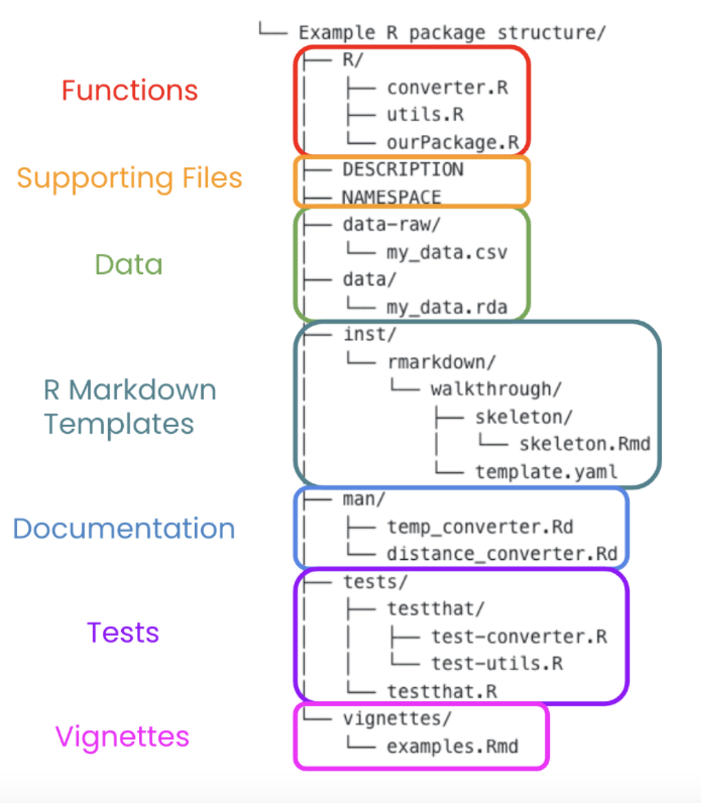
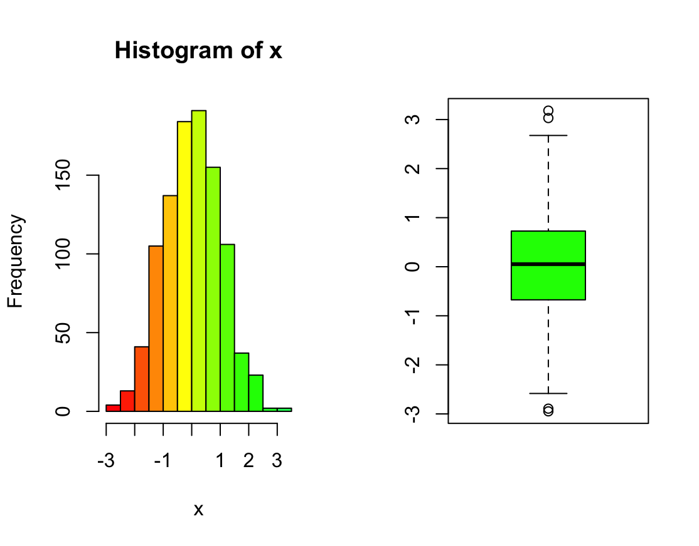
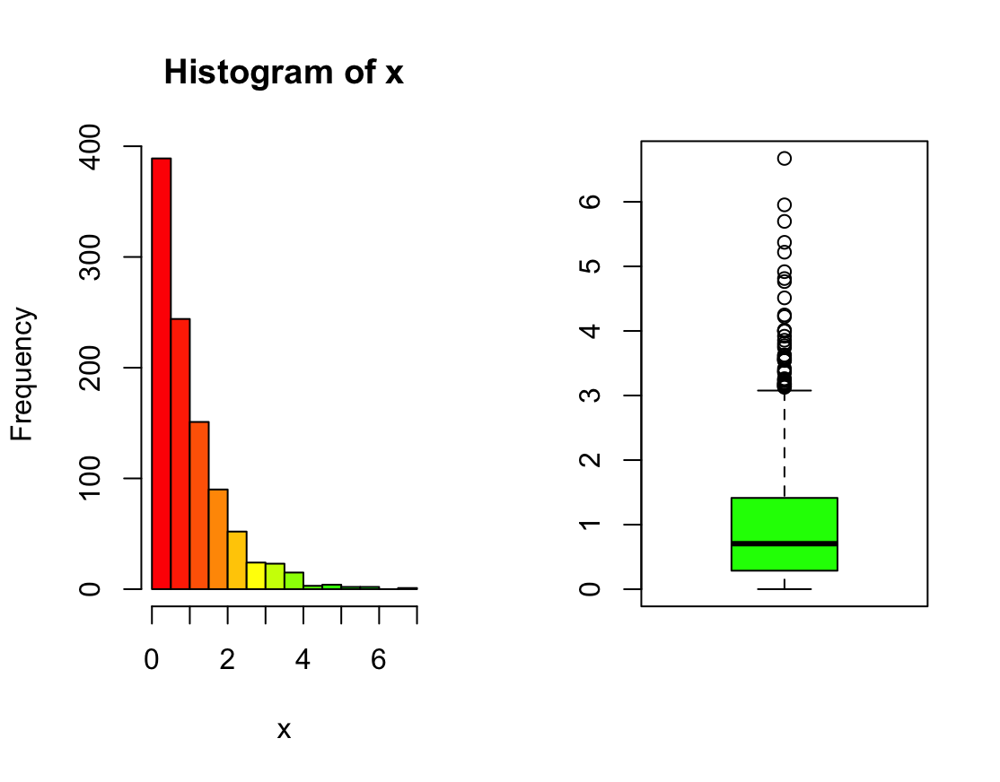

# Developing R Packages
Below are basic instructions and key pointers for building a simple R package using ```devtools```.

### R package folder structure


### Core package functionality

At the very least, R packages need to include:

- `R` directory
- `man` directory
- `NAMESPACE` file
- `DESCRIPTION` file

### Install required packages
```
install.packages("roxygen2")
install.packages("usethis")
```

### roxygen2
**roxygen2** is an R package that simplifies the process of documenting R functions, datasets, and packages. 
It allows you to write documentation directly within the source code using special comments (roxygen comments), which are then processed to generate standard R documentation (.Rd files) automatically.

For example, if you want to document a data file:
```
use_data("some_data")
roxygenize()
```

### Add @importFrom
To include required functions from a package, use `#' @importFrom` in the `.R` file and run `roxygen2::roxygenize()` to update the `NAMESPACE` automatically and generate all function documentation.

Alternatively, use ```use_package()``` function from ```library(usethis)```. For example, ```use_package("stringr", type="Imports", min_version="1.4.0")```.

### Manage dependencies in an R package
Dependencies are listed in the DESCRIPTION file under the Imports, Suggests, or Depends fields.

Example DESCRIPTION file snippet:
```
Imports:
    ggplot2,
    dplyr
Suggests:
    testthat
```

- **Imports**: Functions from these packages must be explicitly called with ```pkg::function()```, unless imported via ```NAMESPACE```.
- **Suggests**: Packages that are optional (e.g., for testing or vignettes).
- **Depends**: Rarely used now, but loads the entire package and its namespace.

### Add a valid license required by CRAN for package distribution
**CRAN** (Comprehensive R Archive Network) is the official repository for R packages.

1. **Use a Standard License with `usethis`**  
   Run one of the following functions in R, depending on the license you want:

   - **MIT License** (Common for open-source projects):
     ```r
     usethis::use_mit_license("Your Name")
     ```
   - **GPL-3 License** (Popular for R packages):
     ```r
     usethis::use_gpl3_license()
     ```

   These functions will:
   - Update your `DESCRIPTION` file with a proper `License:` field.
   - Create a `LICENSE` file in your package directory.

2. **Manually Edit the `DESCRIPTION` File**  
   If you prefer, open your `DESCRIPTION` file and modify the **License** field. For example:

   ```r
   License: MIT + file LICENSE
   ```
   or
   ```r
   License: GPL-3
   ```

   If your license requires a separate file (like MIT), make sure you have a `LICENSE` file in your package directory.

3. **Re-check Your Package**  
   After updating the license, run:
   ```r
   devtools::check()
   ```
   to verify that the warning is gone.
   
### Create vignette
A vignette in an R package is a long-form, structured document that provides detailed explanations, use cases, and examples for the package. It is typically written in **R Markdown** (`.Rmd`) or **Sweave** (`.Rnw`) and is meant to serve as comprehensive documentation beyond function help files.

**Key Features of Vignettes**

- Includes code chunks and narrative text to explain package functionality.
- Automatically built and accessible via `vignette("vignette-name")`.
- Stored in the `vignettes/` directory of an R package.

```
# Create vignette skeleton
library(usethis)
use_vignette(name = "func_visualization", title = "Function Visualization Examples")

# Build all package vignettes
devtools::build_vignettes()

# Browse vignettes
browseVignettes("sherrysPackage")
```

### Unit tests
Unit testing involves testing individual functions or units of code to ensure they behave as expected. It’s crucial in R package development to maintain code quality, identify bugs early, and ensure that updates don’t introduce regressions.

In this example, I have included a basic random unit test for illustrative purposes.

```
# Create testing framework
library(usethis)
use_testthat()

# Create test template files
use_test(name = "temp-visualize")

# Run all of the tests
library(testthat)
test_file("tests/testthat/test-temp-visualize.R")

# Can instead run test_package() to run them all!
test_package("sherrysPackage")
```

### Versioning:
The version is specified in ```DESCRIPTION``` using Semantic Versioning ```(MAJOR.MINOR.PATCH.DEV)```:
Version: 1.0.0

- **MAJOR**: Breaking changes.
- **MINOR**: New features but backward-compatible.
- **PATCH**: Bug fixes.
- **DEV**: Rarely changed, remove for release!

To increment version automatically:
```usethis::use_version("minor")```  # Increments minor version


### R Studio
For some actions, you don’t need to write code manually—you can simply click on buttons in RStudio's interface to accomplish the task.

#### Creating R Package
Go to: **File** → **New Project** → **New Directory** → **R Package using devtools**

#### Enabling Roxygen Documentation

Go to: **Tools** → **Project Options** → Check **"Generate documentation with Roxygen"**

#### Build Options (Top Right Corner)

- **Build** → **Check**: Examine the package: Syntax checks, package dependencies, documentation quality, coding standards, and more. 
- **Build** → **More** → **Load All**: Detect errors (alternatively, use ```load_all()``` function)
- **Build** → **More** → **Document**: Create `.Rd` files under `/man`.  
- **Build** → **More** → **Clean and Install**: Clean and reinstall the package.  

#### Preview Options

- **Preview**: View the current file (`.md`, `.Rd`, etc.).

### Install the package
```
library(devtools)
install_github('sherryxiaoyizhu/r-package')
library(sherrysPackage) # the package name!
```

### Use the package
The following is a sample output from the `visualize` function in the `sherrysPackage` package.

```
y1 <- rnorm(1000)
visualize(y1) # the function call!
```


```
y2 <- rexp(1000)
visualize(y2) # just another function call!
```
 

### Reference
- [Developing R Packages](https://app.datacamp.com/learn/courses/developing-r-packages)
- [How to Create Your Own Package in RStudio](https://www.youtube.com/watch?v=rsQoEgWeJMk)
